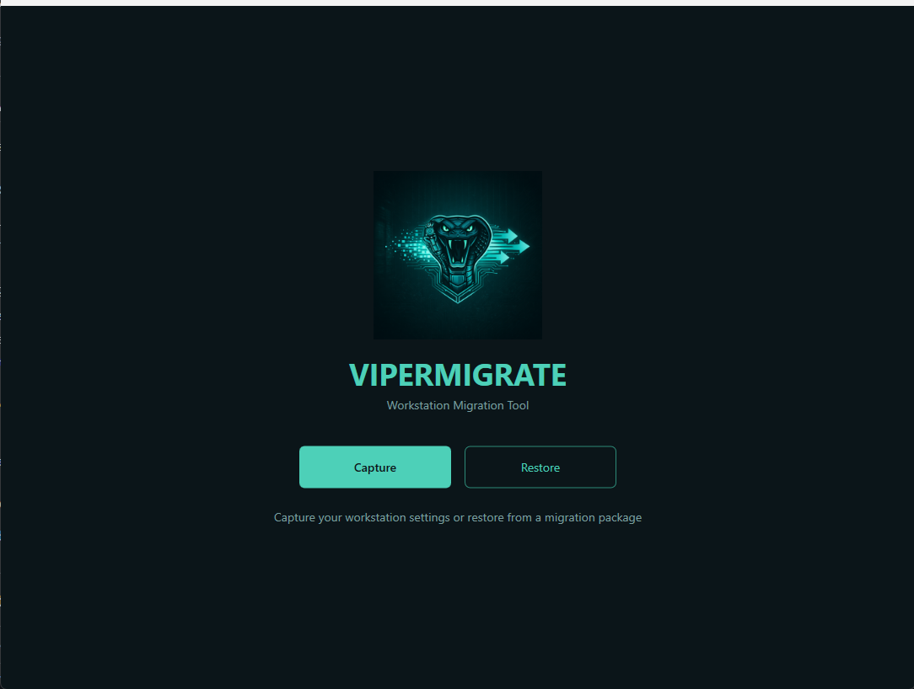
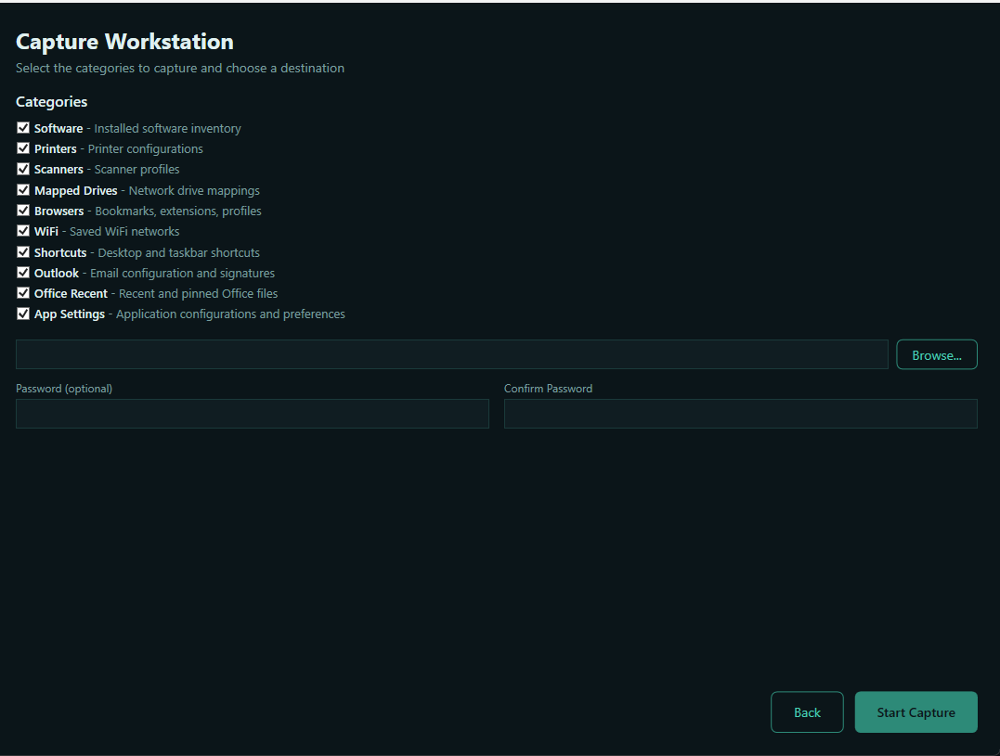
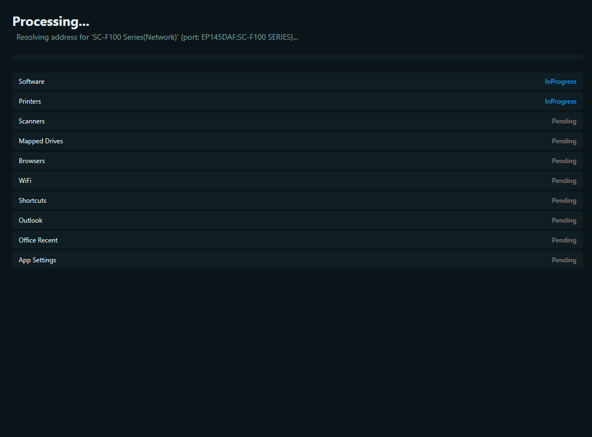
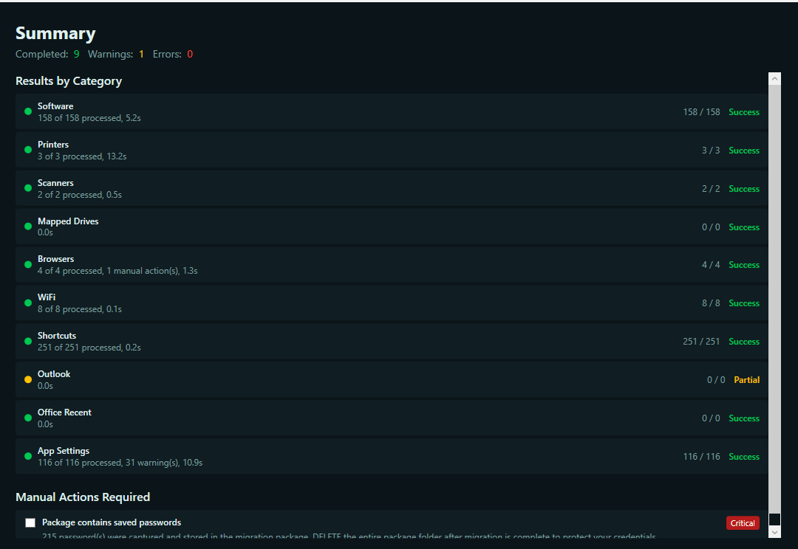
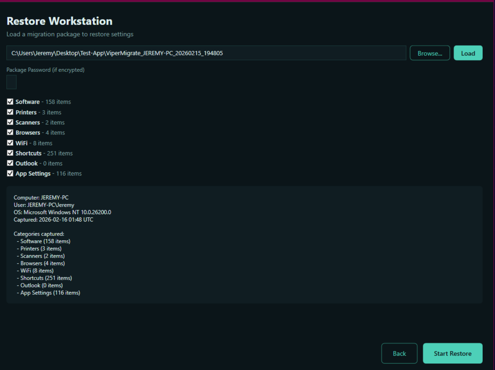
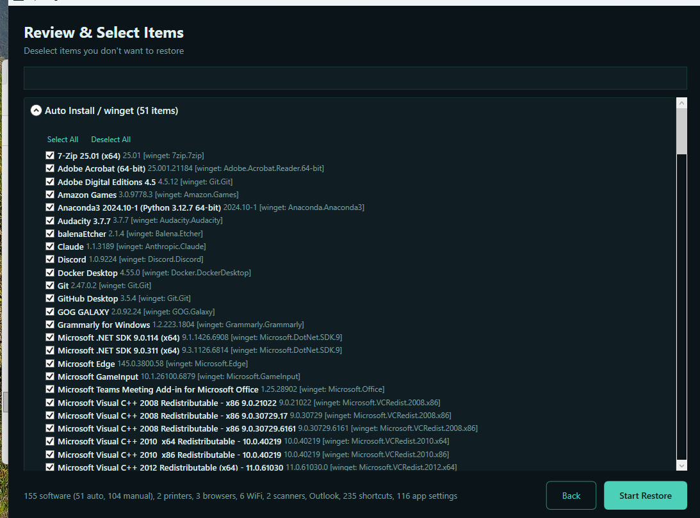
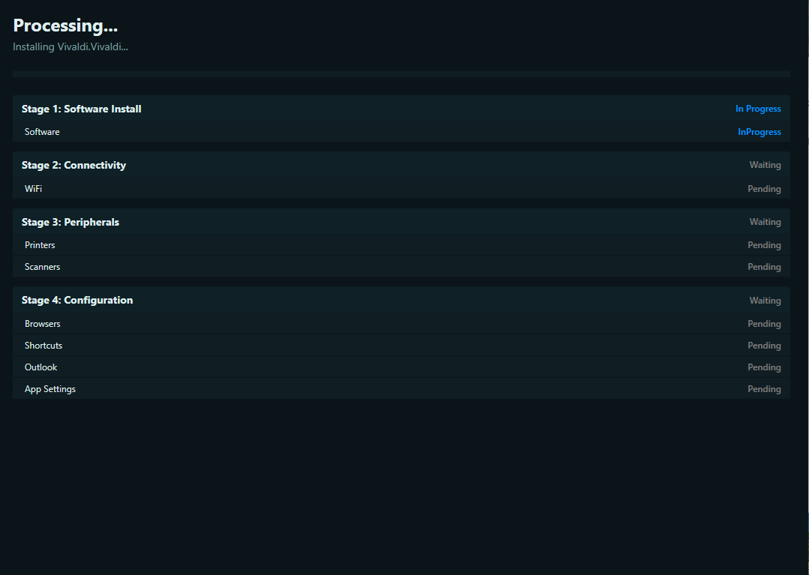
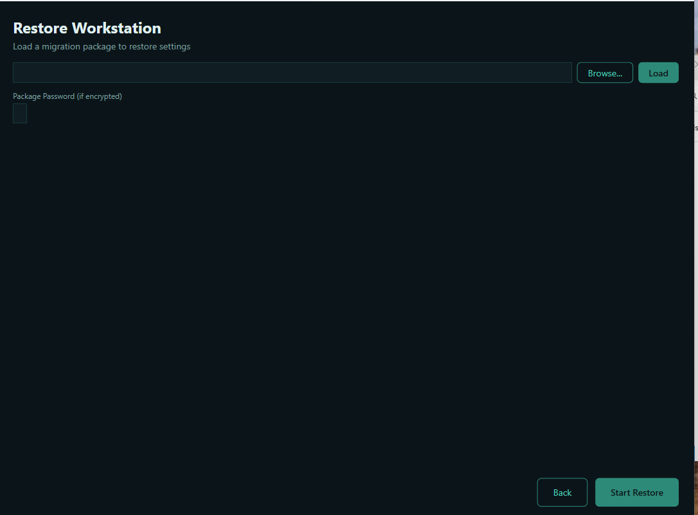
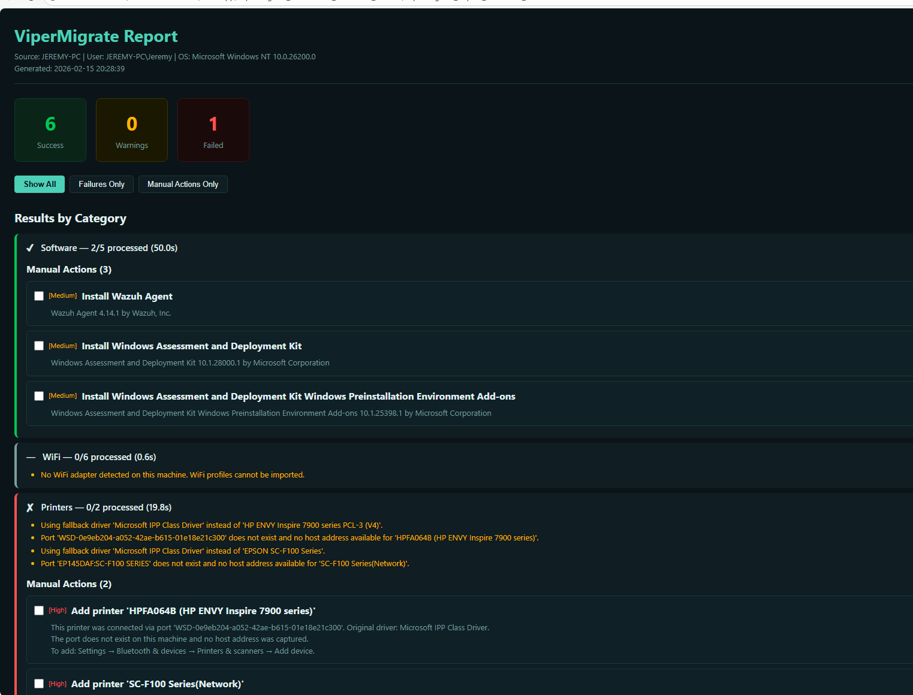
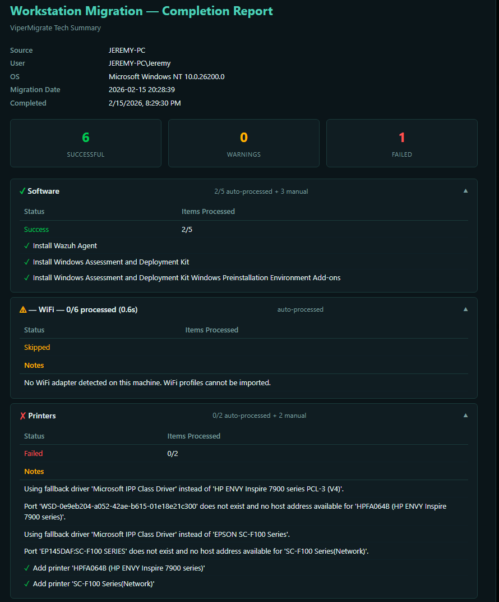

<p align="center">
  
</p>

<h1 align="center">ViperMigrate</h1>

<p align="center">
  <strong>Windows workstation migration tool — capture everything, restore anywhere.</strong>
</p>

<p align="center">
  
  
  
  
</p>

---

## What It Does

ViperMigrate captures a Windows workstation's complete configuration into a single encrypted package, then restores it onto a new machine. Built for IT professionals and MSPs handling PC refreshes, hardware swaps, and Windows migrations at scale.

**Capture** a source machine → **Transfer** the package → **Restore** on the target machine.

## Screenshots

<p align="center">
  
  <br><em>Home Screen</em>
</p>

<details>
<summary><strong>📸 Capture Workflow</strong></summary>
<br>

| Pre-Capture Setup | Capture in Progress | Capture Summary |
|:-:|:-:|:-:|
|  |  |  |

</details>

<details>
<summary><strong>🔄 Restore Workflow</strong></summary>
<br>

| Load Package | Review & Select | Restore in Progress |
|:-:|:-:|:-:|
|  |  |  |

| Restore Complete |
|:-:|
|  |

</details>

<details>
<summary><strong>📊 Reports</strong></summary>
<br>

| Migration Report | Completion Report |
|:-:|:-:|
|  |  |

</details>

---

### What Gets Migrated

| Category | Details |
|----------|---------|
| **Software** | Installed applications via winget auto-install + manual install list for non-winget apps |
| **Browsers** | Profiles, bookmarks, extensions, and settings for Chrome, Edge, Firefox, Vivaldi, Brave, Opera |
| **Printers** | Network, IP, and local printers with driver resolution and multi-method IP discovery |
| **Wi-Fi** | Saved wireless network profiles with credentials |
| **Shortcuts** | Desktop, Start Menu, taskbar pins, Quick Launch, and startup entries |
| **Outlook** | Email signatures, recent files, and profile configuration |
| **App Settings** | Application configurations and profiles from AppData (roaming and local) |
| **Drive Maps** | Mapped network drives with credentials |
| **Scanners** | WIA scanner/imaging device profiles |

### Key Features

- **Selective restore** — review and deselect individual items before restoring
- **Winget integration** — auto-installs software via Windows Package Manager
- **Encrypted packages** — AES-256 password-protected migration files
- **Staged restore** — software → connectivity → peripherals → configuration → verification
- **HTML reports** — interactive post-migration report with manual action checklists
- **Smart printer handling** — 6+ method IP resolution chain, IPP auto-negotiate, universal driver fallback
- **Browser detection** — dynamic detection of all Chromium-based and Firefox-family browsers

## Requirements

- Windows 10 or Windows 11
- .NET 8.0 Desktop Runtime
- Administrator privileges (for printer, Wi-Fi, and driver operations)
- [winget](https://github.com/microsoft/winget-cli) (pre-installed on Windows 11, available for Windows 10)

## Download

Grab the latest release from the [Releases](https://github.com/jtarkington77/ViperMigrate/releases) page — single portable `.exe`, no installation required.

## Building

```bash
dotnet publish src/ViperMigrate.App/ViperMigrate.App.csproj -c Release -r win-x64 --self-contained true -p:PublishSingleFile=true -p:IncludeNativeLibrariesForSelfExtract=true -o ./publish
```

Or open `ViperMigrate.sln` in Visual Studio 2022 and build.

## Project Structure

```
ViperMigrate/
├── src/
│   ├── ViperMigrate.App/          # WPF desktop application
│   │   ├── Assets/                # Logo, icons
│   │   ├── Converters/            # XAML value converters
│   │   ├── Themes/                # Styles and color resources
│   │   ├── ViewModels/            # MVVM view models
│   │   └── Views/                 # XAML views
│   └── ViperMigrate.Core/        # Core migration engine (no UI dependency)
│       ├── Capture/
│       │   └── Collectors/        # Per-category capture logic
│       ├── Common/                # Shared utilities, helpers, report generator
│       ├── Models/                # Data models for captured items
│       └── Restore/
│           └── Applicators/       # Per-category restore logic                     # Test projects
├── assets/                        # Branding assets and screenshots
└── ViperMigrate.sln
```

## Architecture

ViperMigrate follows a **Collector/Applicator** pattern:

- **Collectors** (`ICaptureCollector`) run on the source machine to gather data for each category
- **Applicators** (`IRestoreApplicator`) run on the target machine to apply captured data
- The **MigrationPackage** model is the serialized data contract between capture and restore
- Restore runs in **stages** (Software → Connectivity → Peripherals → Configuration → Verification) to ensure dependencies are met before downstream steps

Each collector/applicator pair is independent — categories can be individually selected or skipped.

## Author

Built by **Jeremy Tarkington** — [jtarkington77](https://github.com/jtarkington77)

Part of the **Viper** tool ecosystem.
